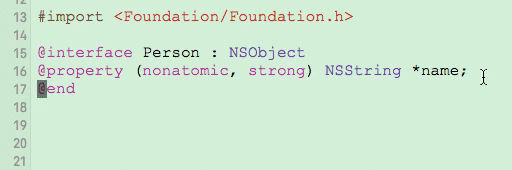
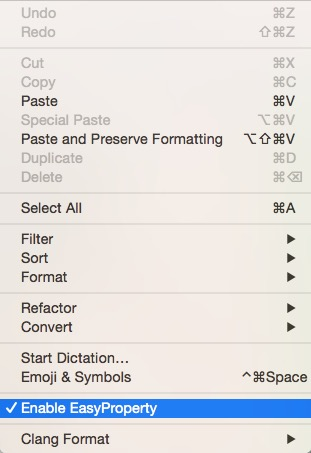

# EasyProperty 

EasyProperty is inspired by [ATProperty](https://github.com/Draveness/ATProperty).

New features:

1. `@s` only trigger in `@interface` block.
2. Automatic positioning the cursor to the `type`
3. undo/redo supports.


## What is this?

This is a convenient and fast approach to create property. You do not need to type `@property` and `nonatomic` when you declare a property.

You just needs to type `@s` like this.



## How to install?

You can clone the repo and build the target. And the plug-in will automatically be installed in `~/Library/Application Support/Developer/Shared/Xcode/Plug-ins`. Relaunch Xcode, and you can use this to create property.

## Usage

This plug-in is extremely easy to use.

### Common

| typein   | result |
| :------- | :----------------------------- |
| @s       | @property (nonatomic, strong) type *value;  |
| @w       | @property (nonatomic, weak) type *value;    |
| @d       | @property (nonatomic, weak) id\<type\> value; |
| @c       | @property (nonatomic, copy) type *value;    |
| @a       | @property (nonatomic, assign) type value;   |

### Readonly

| typein   | result |
| :------- | :----------------------------- |
| @rs      | @property (nonatomic, strong, readonly) |
| @rw      | @property (nonatomic, weak, readonly)   |
| @rc      | @property (nonatomic, copy, readonly)   |
| @ra      | @property (nonatomic, assign, readonly) |

### Readwrite

| typein   | result |
| :------- | :----------------------------- |
| @xs      | @property (nonatomic, strong, readwrite) |
| @xw      | @property (nonatomic, weak, readwrite)   |
| @xc      | @property (nonatomic, copy, readwrite)   |
| @xa      | @property (nonatomic, assign, readwrite) |


### Outlet

| typein   | result |
| :------- | :----------------------------- |
| @iw      | @property IBOutlet (nonatomic, weak) |

## Customize

You can enable/disable the `EasyProperty` plugin in menu:

```
Edit => Enable EasyProperty
```




----

# Contribute

Feel free to open an issue or pull request, if you need help or there is a bug.

# Contact

- Powered by [langyanduan](http://github.com/langyanduan)

# License

EasyProperty is available under the MIT license. See the LICENSE file for more info.


